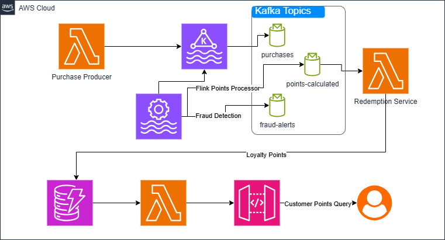

# Real Time Loyalty Platform
Real-Time Loyalty Points Accrual &amp; Redemption

## Architecture diagram

## Tech Stack
AWS & Cloud-Native Components:

- AWS MSK → Kafka backbone for all events.
- Flink on EKS → Stateful processing for points calculation and fraud detection.
- DynamoDB → Low-latency store for loyalty points.
- AWS Lambda + API Gateway → Query interface for customers.
- S3 → Exported events for historical analysis (Athena).
